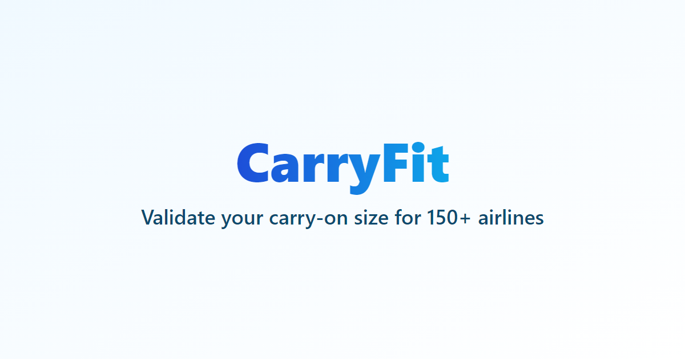

# CarryFit - Carry-on Luggage Compliance Checker



CarryFit helps travelers check if their carry-on luggage meets the size requirements for different airlines worldwide. Simply enter your bag's dimensions, and instantly see which airlines will accept it as cabin baggage.

## Key Features

- Instant compliance checking for 100+ airlines worldwide
- Flexible bag dimensions support - account for slightly squeezable luggage
- Semi-automated policy monitoring system with verification dates
- Smart filtering by region and favorites
- Visual compliance scoring and indicators
- Direct links to airline policies
- Responsive design for mobile and desktop

## Live Demo

Visit [CarryFit](https://carryon.fit/) to try it out!

## Development

This project is built with:

- [SvelteKit](https://kit.svelte.dev/)
- [TailwindCSS](https://tailwindcss.com/)

To run locally:

```bash
# Clone the repository
git clone https://github.com/AxelUser/carry-fit.git

# Install dependencies
pnpm install

# Start development server
pnpm dev
```

## Contributing

We welcome contributions! Please see our [Contributing Guide](CONTRIBUTING.md) for details.

### Ways to Contribute

- Report bugs or suggest features through GitHub Issues
- Submit pull requests for improvements
- Help update airline baggage policies

## Support the Project

- Star the repository on GitHub
- Support development via [Buy Me a Coffee](https://www.buymeacoffee.com/axeluser)
- Share with fellow travelers

## License

MIT License - see [LICENSE](LICENSE) for details.

## Author

Created by [Aleksey Maltsev](https://www.maltsev.space/)
